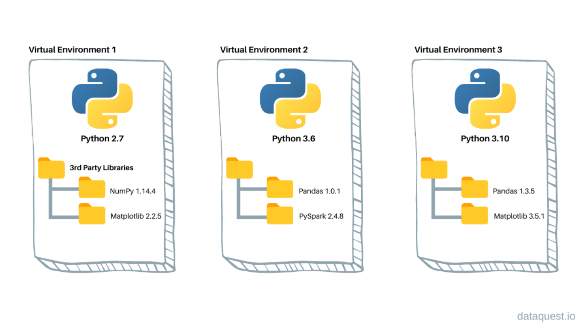

# Python environments

(Just for your culture. No setup action in this page)

To use Brightway on your computer, we will install it in a specific **Python envrionment**. This good practice allows you to keep a clean installation of Brightway and all the packages/libraries it requires (called *dependencies*), isolated from any other Python project you may have.

## What are Python evironments?

A **Python environment** (or virtual environment) is a sort of virtual *workspace* where you can install and use specific Python tools and libraries without interfering with other projects on your computer:

* Each environment have **its own version of Python** (e.g., 3.10, 3.11, 3.12, etc.)
* Each environment have **its own set of Python libraries** (e.g., Brightway, NumPy, Pandas, etc.)



This allows you to have several independant Python *workspace* to run your projects. This is especially useful when you need different versions of a library, or when you use libraries which have strict dependencies version requirements. For example, one project can require *NymPy v1.26*, and another require *NumPy v2.0*.

In practice, a virtual environment is a folder on your computer, typically stored here: `C:\Users\<user>\AppData\Local\miniforge3\envs`.

Inside, you will find a **Python interpreter `python.exe`** corresponding to the Python version installed in this specific environment.

There is also the code of all the packages/libraries you installed, typically in (in `<env_name>\lib\site-package`).

You can have as many python environments as you wish, in addition to the `base` one (the one used by default if no other environment is specified).

## Python environment and Brightway projects

As explained above, **Python environments** are just parallel installations of Python and packages/libraries on your computer, which you can use to run Python-based software. These environments are independant from the rest of your files and folders on your computer. Thus:

* Creating or deleting a Python environment has no impact on files and folders outside of the environment, e.g. Brightway files and folders
* Creating or deleting files and folders outside of the environment has no impact on the Python environment.

Brightway relies on project files stored in a project folder, typically in `C:\Users\<user>\AppData\Local\pylca\Brightway3`. These files and folders are thus totally independant from the Python environments ones.

```code
C:\<user>\AppData\Local
├── ...
├── miniforge3
│ ├── envs
│ │ ├── my_virtual_env_1
│ │ └── my_virtual_env_1
├── ...
├── pylca
│ ├── Brightway3
│ │ ├── bw_project_1
│ │ ├── bw_project_2
```

A Brightway project is simply run using a version of Python in a virtual environment.
